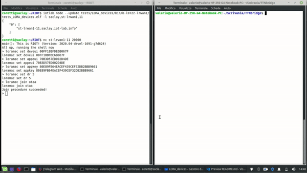

# RIOT-based virtual devices with LoRaWAN 
This application represents a virtual environmental station that, periodically, generates random values for:
* temperature (-50... 50 Celsius)
* humidity (0... 100%)
* wind direction (0... 360 degrees)
* wind intensity (0... 100 m/s)
* rain height (0... 50 mm / h)

Each virtual sensor will send these random values to The Things Network trough the LoRaWAN real device, running on IoT-LAB. The script for the sensors are based RIOT-OS, and  generates a JSON payload structured as follow:

      const payload = {
      deviceId: "station",
      temperature: getRndInteger(-50, 50),
      humidity: getRndInteger(0, 100),
      wind_direction: getRndInteger(0, 360),
      wind_intensity: getRndInteger(0, 100),
      rain_height: getRndInteger(0, 50),
      date: parseInt(Date.now()/1000)
      }
        
The date is important for the database and the dashboard that will have to show the last hour values received for every sensor.

## Setup and run
In this section, I'll explain you how to submit this application with one LoRa node on IoT-LAB, flash a RIOT firmware for LoRaWAN and connect the node to your application in the TTN network.

1. Connect to the Saclay site host:
```
      ssh <login>@saclay.iot-lab.info
```
2. Start an experiment with 1 node called riot_ttn
```
      iotlab-auth -u <login> 
      iotlab-experiment submit -n riot_ttn -d 60 -l 1,archi=st-lrwan1:sx1276+site=saclay
```
3. Remember the experiment identifier returned by the last command. It’ll be used in the commands shown below, <exp_id>. The requested experiment duration is 60 minutes. Wait a moment until the experiment is launched (state is Running) and get the nodes list. For the next steps of this tutorial we suppose that you obtained st-lrwan1-1.saclay.iot-lab.info
```
      iotlab-experiment get -i <exp_id> -s
      iotlab-experiment get -i <exp_id> -r
```
4. Get the code of RIOT and of my applciation from GitHub:
```
      git clone https://github.com/RIOT-OS/RIOT.git
      cd RIOT/tests/
      git clone https://github.com/valecor95/LORA_devices.git
```
5. Important: RIOT doesn’t support the arm gcc version installed by default on the SSH frontend, e.g. 4.9. So we provide arm gcc 7.2 in /opt/gcc-arm-none-eabi-7-2018-q2-update. Use the following command to use gcc 7.2 by default:
```
      export PATH=/opt/gcc-arm-none-eabi-7-2018-q2-update/bin:$PATH
```
6. Build my LoRaWAN application:
```
      cd LORA_devices/
      make clean all
```
7. Use the CLI-Tools to flash the ST LoRa node with the LoRaWAN firmware that you have just built and the access the RIOT shell via netcat:
```
      iotlab-node --update tests/LORA_devices/bin/b-l072z-lrwan1/tests_LORA_devices.elf -l saclay,st-lrwan1,1
      nc st-lrwan1-1 20000
```
8. Now find the Device EUI, Application EUI and Application key information in the Overview tab of the iotlab-nodedevice on the TTN web console.Then set them to the RIOT firmware (replace the values with yours), then set the datarate and join the device on ttn:
```
      loramac set deveui 0000000000000000
      loramac set appeui 0000000000000000
      loramac set appkey 00000000000000000000000000000000
      loramac set dr 5
      loramac join otaa
```
9. Now you are ready to run the periodic sending of data:
```
      ttn_pub <device-id>
```

NOTE: the complete tutorial to use LoRaWAN node in IoT-LAB is available here: https://www.iot-lab.info/tutorials/riot-ttn/

