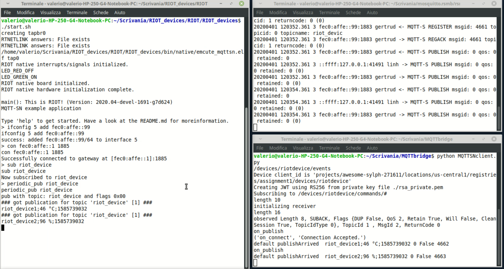

## About
To send the data at the MQTT Google broker we have to establish a connection. To do this I took an RSMB client and an MQTT client and joining them I've created a device that receives data via MQTT-SN and sends it to Google via MQTT. Inside this folder there are five python files:

`MQTTSNclient.py` `MQTTSNregister.py` `MQTTSN.py` `MQTTSNinternal.py` `GoogleMQTTClient.py`

The first four are the same files of the folder MQTTSNclient that you can find in `mosquitto.rsmb/rsmb/src` while the last file is a simple python Class that implements the main methods to interact with Google MQTT bridge. I took the latter directly from the google guide and I simplify for our purpose: https://cloud.google.com/iot/docs/how-tos/mqtt-bridge

## Setup and run
1. Open the Bride folder:
```
cd MQTTSNbridge/
```
2. Install all the modules needed:
```
pip install
```
3. Start the bridge (This procedure has to be done before to launch the RIOT devices):
```
python MQTTSNclient.py
```
Note: this implementation uses Python 2.0

If everything goes well you should have this view:
