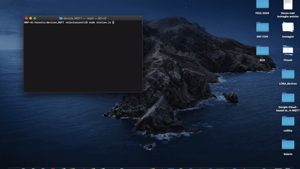

# Google-Cloud-based-IoT-system-with-MQTT

This is a project made for the Internet of Things class at the Sapienza University of Rome.
It is a cloud-based IoT system that collects information from a set of virtual environmental sensors using the MQTT, MQTT-SN, and LoRaWAN protocol and displays it in a simple web site dashboard.

The MQTT is managed using the cloud-based backend of the Google IoT Core platform.

Technology used: Python, C, RIOT-OS, MQTT-SN, LoRaWAN, Node.js, MQTT, WebSockets, MongoDB, JQuery, Bootstrap CSS and HTML.
___
## Assignments
The following are the branches that contain all the assignments one after the other:
* ##### [Assignment 1](https://github.com/valecor95/Google-Cloud-based-IoT-system-with-MQTT/tree/assignment1)
* ##### [Assignment 2](https://github.com/valecor95/Google-Cloud-based-IoT-system-with-MQTT/tree/assignment2)
* ##### [Assignment 3](https://github.com/valecor95/Google-Cloud-based-IoT-system-with-MQTT/tree/assignment3)

___
## Tutorials
The following are a series of tutorials on how to set up the system step by step. I recommend you to see before the hands-on tutorials on Hackster.io and then the video tutorials for a better understanding.

### Hands-on tutorials

* ##### [Tutorial 1](https://www.hackster.io/valeriocoretti/google-cloud-based-iot-system-with-mqtt-32c4dd)
* ##### [Tutorial 2](https://www.hackster.io/valeriocoretti/google-cloud-based-iot-system-with-riot-os-and-mqtt-sn-6f4cff)
* ##### [Tutorial 3](https://www.hackster.io/valeriocoretti/google-cloud-based-iot-system-with-mqtt-and-lorawan-e8e5b0)

### Video tutorials
* ##### [Video Tutorial 1](https://youtu.be/lChD2VoH1Jk)
* ##### [Video Tutorial 2](https://youtu.be/jvvW0CW-DJM)
* ##### [Video Tutorial 3](https://youtu.be/K1Z90tZD1KU)
___
## Web Dashboard
The Heroku web dashboard is available here:
* #### [Dashboard - Heroku](https://iot-assignment1.herokuapp.com)
___
## Author 
#### Valerio Coretti:
* [LinkedIn](https://www.linkedin.com/in/valerio-coretti-2913721a3/)
* [YouTube](https://www.youtube.com/channel/UCfOMLbUeIE53mk2k_40gjoA?view_as=subscriber)
* [Hackster.io](https://www.hackster.io/valeriocoretti)
