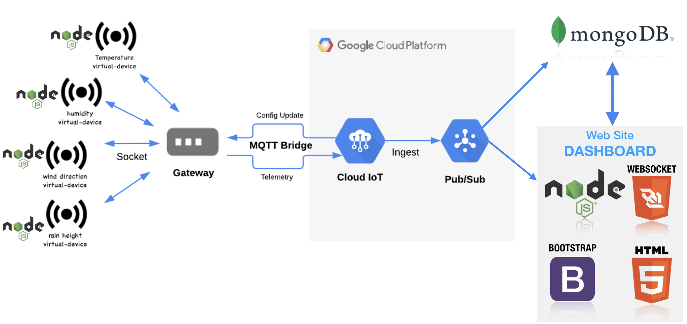
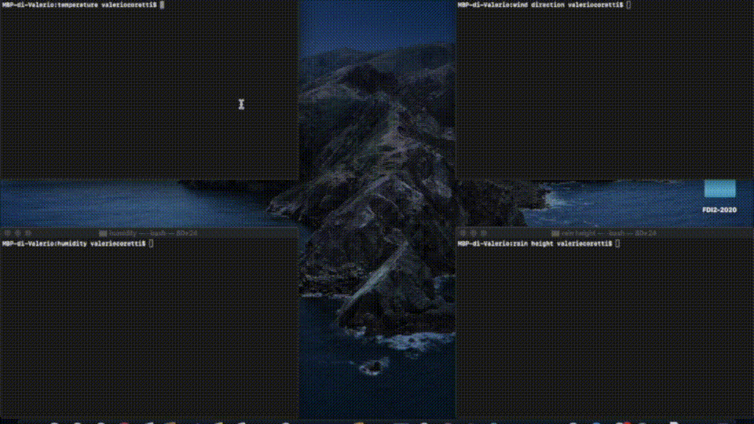

# Cloud-based-IoT-system-with-MQTT

This is a project made for the Assignment1 of Internet of Things class at Sapienza University of Rome.
In this assignment I created a cloud-based IoT system that collects information from a set of virtual environmental sensors using the MQTT protocol. I also create a simple web site dashboard to display the data collected from the sensors.
The MQTT is managed using the cloud-based backend of Google IoT platform.

TECHNOLOGY USED: Node.js, MQTT, WebSockets, MongoDB, JQuery, Bootstrap CSS and HTML.

___
* #### [Heroku Dashboard](https://iot-assignment1.herokuapp.com)

* #### [Hands on Tutorial - Hackster Blog Post](https://www.hackster.io/valeriocoretti/cloud-based-iot-system-with-mqtt-32c4dd)

* #### [Video Tutorial - Youtube]()
___

