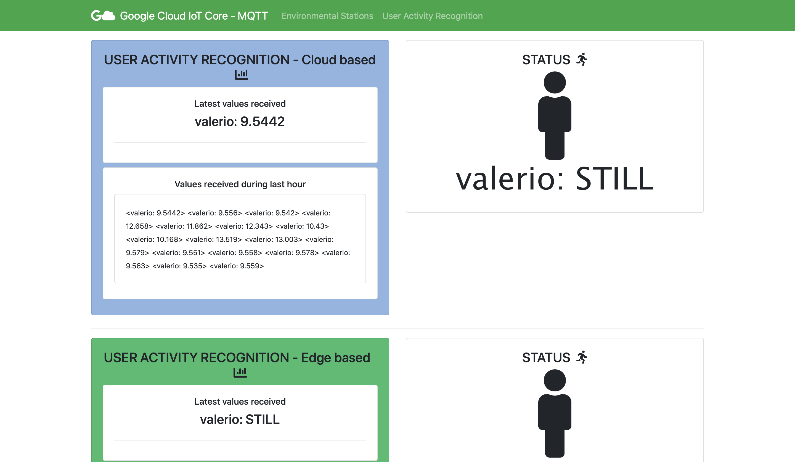

# UAR - User activity recognition

This is an HTML5 crowd sensing application that, using the Generic Sensor API, collects data form the accelerator sensor of the mobile phone. The values collected are transmitted to your Cloud infrastructure.

Using the data collected at the cloud, I develop a simple activity recognition model that detects if the user is standing still, or moving. Consider that assuming a movement of at most 0.5 Hz (i.e., 30 steps per minute), a sampling frequency of 1Hz (i.e., 1 message per second) is theoretically sufficient to recognize the pattern. 

This application is based on NodeJS and HTML5. For our purpose the application is deployed in two modes: `Cloud-based Deployment` and `Edge-based Deployment`.
Notice that for semplicity of testing my application do both approach together, but is very simple to divide them.

### Cloud-based Deployment
Given the data arriving to the cloud, executes the model and provide a status for the state of the user whenever new values arrive and displays them in a web dashboard that provides the following functionality:

* Displays the latest values received from all the sensors and the resulting activity.
* Displays the values received during the last hour from all the sensors and the resulting activity.

### Edge-based Deployment
Given the data collected by the mobile phone, the model is executed locally to provide a status for the state of the user.

The raw sensor data are not transmitted to the cloud. Instead only the outcome of the activity recognition model should be transmitted to the cloud. The web dashboard will display:

Display the latest activity of the user.
Display the activities received during the last hour.

**More details are available in the hands-on tutorial here**: [Tutorial](https://www.hackster.io/valeriocoretti/user-activity-recognition-with-generic-sensor-api-and-google-3c6f88)