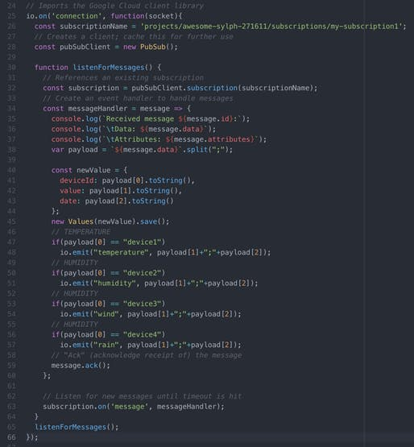
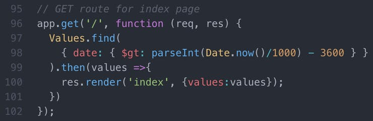
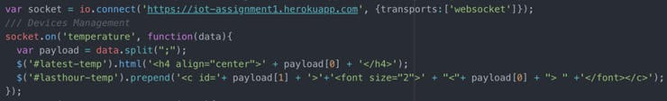

# Dashboard

The dashboard is a simple web application based on NodeJS, MongoDB, Bootstrap, JQuery and Handlebars. Furthermore, it uses the connection protocol WebSocket to display the values in real time.

The main functionalities of the dashboard are:
* Display the latest values received from all the sensors of a specified environmental station.
* Display the values received during the last hour from all environmental stations of a specified sensor.

The process flow is very simple

When the server starts, it listens for messages from the Pub/Sub service of Google Cloud (line 65) accessing to the subscription created before (line 32). When a message arrives from the platform, the server pull it (line 63) and first of all sends it to the MongoDB database (line 40-45), then shows it in the dashboard through the WebSocket connection (line 47-57). Finally, it sends an ack to the Cloud (line 59). This whole process works asynchronously.

For more details on how to pull the messages from the GCP, I based my code on the following Google Guide: [Receiving messages using Pull - Guide](https://cloud.google.com/pubsub/docs/pull)

This process, therefore, includes the display of the latest values received. About the values received during the last hour, I had to change the code a bit and insert the management of arrival times.

When the web pages are accessed (or refreshed) it sends a query to the database to retrieve only values that have an arrival date of no more than one hour. As you can see in the code (line 98) we use the *Date.now()* function which returns the number of milliseconds, elapsed since January-1-1970, divided by 1000 to convert it in seconds. This allows us an easy management of the functionality because we can simply subtract 3600 seconds to have the last hour. In this way even if the sensors stop sending messages we have a list of the last hour values always updated.

About the front-end the most relevant part is how to handle messages arrived from web socket and how to display it:

The first line sends the connection request. When the connection receives a message (payload) the system simply updates the container of the latest value and prepends the new value in the container of the last hour values.

The web dashboard is deployed by Heroku at this link:
https://iot-assignment1.herokuapp.com