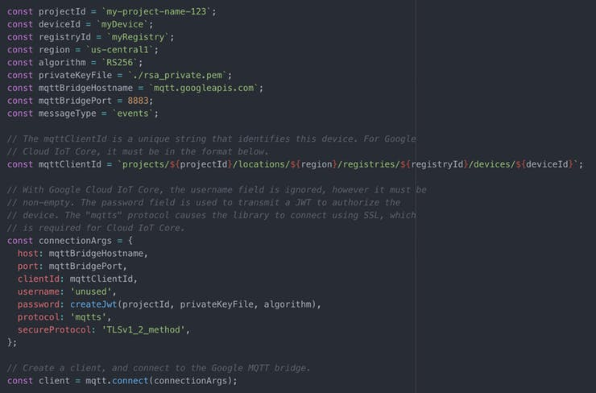

# NodeJS Virtual Devices
I have created a stand-alone program for every sensor that represents a virtual environmental station that generates, periodically, random values for:

* temperature (-50... 50 Celsius)
* humidity (0... 100%)
* wind direction (0... 360 degrees)
* rain height (0... 50 mm / h)

Each virtual sensor will publish these random values on the MQTT Google channel. The scripts for the sensors are based on Node.js and the code is essentially the same for every sensor apart for the values to send, for this reason, I'll show you only the temperature sensor.

## Publish/Subscribe process

Here I manage the main Publish/Subscribe process. The first thing to do is to connect the sensor to the Google platform by entering the arguments previously created (on the Set Up Google Cloud Platform section).

If the connection is successful the sensor starts to send the random values (line 100-105). The subsequent functions handle the errors (line 113), the closing connection (line 109) and the other messages subscribing by the platform (line117).

## Generate and Publish values

The image above shows how to create and publish the values to the platform. Values are generated by getRndInteger (line 38) and then they are asynchronously published by the function publishAsync (line 43), every 5 seconds.

I used a Quality of Service qos1 (line 43) that is equivalent to the paradigm: at least once. Indeed with this choice, we could have the problem of duplicates but we have also higher reliability than qos0 (at most once) which could lose data. (Note: Google IoT Core doesn't support qos2, exactly once).
Furthermore is important to know how the payload is made:

> deviceId ; temperature ; date

This structure allows the web site dashboard to split the message and to know: which device has sent the value, the value itself, and the date. The date is important for the database and the dashboard that will have to show the last hour values received for every sensor.

For more details on this part I based my code on the following Google Guide: [Publishing over the MQTT bridge - Guide](https://cloud.google.com/iot/docs/how-tos/mqtt-bridge#publishing_telemetry_events)